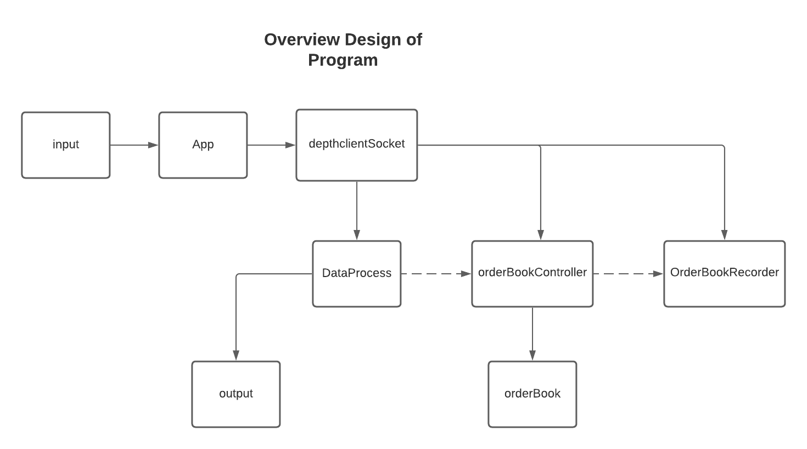

<h1 align="center">Cryto Binance Local Order Book</h1>


## Project Description
AIM: To create a local order book that replicates the Binance order book. This local copy will be used to compute weighted buy and sell prices. 

## System Design Overview
The system design objective is to create high level of maintainable design, correct and extendable.


**Overview Design of the App**


 

## Instruction to run the Application
First time running process 
```
git clone https://github.com/shouryaraj/cryto-binance-local-order-book.git

cd cryto-binance-local-order-book

npm install

node app.js

```
Normal running of application
```
node app.js
```

**Note:**  User have the option to put the desire value of transaction quantity either for buy or sell  

App.js file configuration to change *Currency, time and trade option*


## Current work
+ Creating a local copy of the Binance’s BTCUSDT market and easily can be changed for other assets.
+ Weighted pricing to buy or sell the aforementioned quantity of Bitcoin.

## Future Work
+ Detailed design and explanation of the system in the Readme.md
+ Look for more optimised solution

